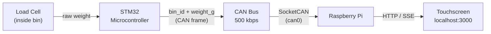
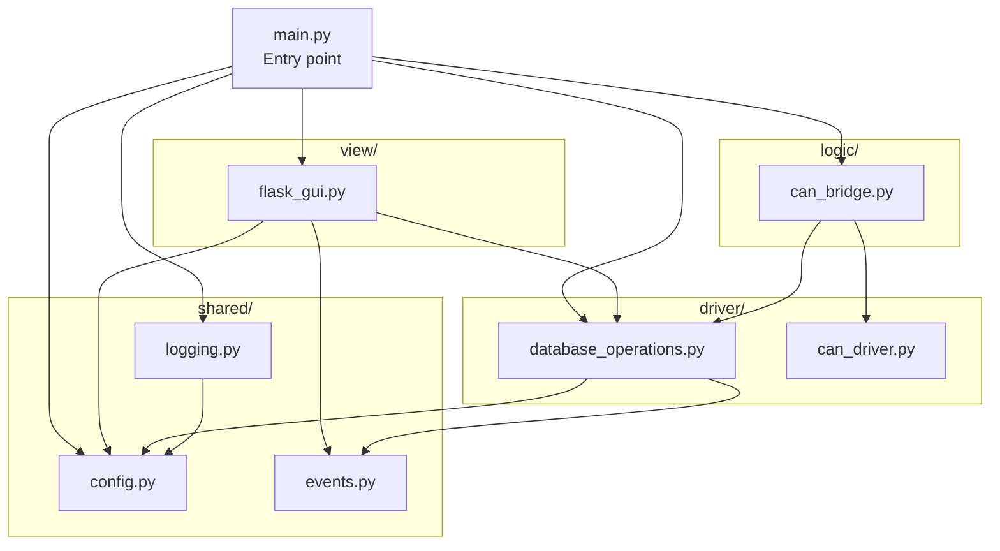
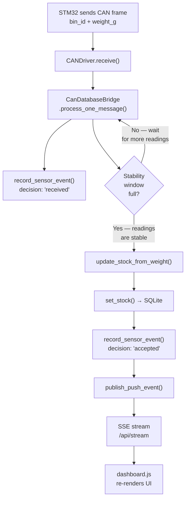

# AIM — Ambulance Inventory Management

AIM is a real-time inventory dashboard for ambulance supply bins. Weight sensors inside each bin are read by a microcontroller, which sends that data to a Raspberry Pi over a CAN bus. The Pi calculates how many items are left in each bin and displays a live dashboard on a touchscreen mounted in the ambulance.

The goal is to let paramedics see at a glance which supplies are running low — without manually counting anything.

---

## What the Dashboard Shows

> **Screenshot suggestions:**
> 1. The full dashboard with several bins at different stock levels (green, yellow, red)
> 2. The detail panel open on the right side for a selected bin
> 3. The Add Bin modal
> 4. The Calibration tab inside the detail panel

The dashboard has three main areas:

**Stats bar (top)** — Shows total number of bins, overall stock percentage, how many bins are low, and how many are critical.

**Bin grid (main area)** — One card per bin. Each card shows:
- The bin number and item name
- A gauge showing what percentage of the full stock is present
- The current count vs. the needed count
- A coloured left border: green = stocked, yellow = low (under 50%), red = empty

**Detail panel (right side)** — Opens when you tap a bin card. Shows:
- A larger gauge
- Manual +/− stock adjustment buttons
- A tare button to re-zero the scale
- A history sparkline of recent stock levels
- An Events tab with a timestamped log of every sensor reading
- A Calibration tab to fine-tune scale factor and rounding

---

## Hardware Overview



Each bin has a load cell connected to an STM32. The STM32 packages the bin ID and raw weight into an 8-byte CAN frame and broadcasts it. The Pi's MCP2515 CAN controller receives those frames and the software does the rest.

---

## For Non-Technical Users

Once the system is set up and running, you interact with it entirely through the touchscreen. There is nothing to install or configure day-to-day.

**To check stock:** The bin grid is always visible. Green = fine, yellow = getting low, red = empty.

**To adjust stock manually** (e.g. after restocking without the scale detecting it): Tap the bin card, then use the − and + buttons in the detail panel.

**To tare a scale** (re-zero it after the bin is emptied and cleaned): Tap the bin card, go to the Overview tab, and press **TARE SENSOR** while the bin is empty and sitting normally on the scale.

**To add a new bin:** Press **+ ADD BIN** in the filter bar and fill in the form.

---

## Getting Started (Developers)

### Prerequisites

- Raspberry Pi (or any Linux machine with a SocketCAN interface)
- Python 3.13
- [PDM](https://pdm-project.org/) for dependency management
- A `can0` interface configured (or the CAN bridge will disable itself gracefully)

### Installation

```bash
# 1. Clone the repository
git clone <repo-url>
cd aim-frontend

# 2. Install Python dependencies
pdm install

# 3. Install additional runtime dependencies
pdm add python-dotenv python-can

# 4. Generate your .env file interactively
pdm run setup-env
```

### Configuration

All runtime settings live in `.env`. The defaults work out of the box for a standard Pi + MCP2515 setup. The settings you are most likely to change:

| Variable | Default | Description |
|---|---|---|
| `AIM_CAN_CHANNEL` | `can0` | SocketCAN interface name |
| `AIM_CAN_BITRATE` | `500000` | Must match the STM32 bitrate |
| `AIM_DB_PATH` | `inventory.db` | Where to store the SQLite database |
| `AIM_FLASK_PORT` | `3000` | Port the dashboard serves on |
| `AIM_LOG_LEVEL` | `INFO` | Set to `DEBUG` for verbose output |
| `AIM_LOG_PATH` | `logs/aim.log` | Log file location |

See `.env.example` for the full list with descriptions.

### Running

```bash
pdm run start
```

Then open `http://localhost:3000` in a browser, or navigate to it on the Pi's touchscreen.

The CAN bridge starts automatically in a background thread. If `can0` is not available (e.g. running on a development laptop), the dashboard still loads and works — you just won't receive live sensor data.

### Seeding Initial Bins

The bins and their items are seeded in `aim_central/main.py` inside the `seed_containers()` function. Edit the `ITEMS`, `CONTAINERS`, and `CALIBRATIONS` lists to match your physical setup, then restart the server. `INSERT OR IGNORE` is used throughout, so re-running never overwrites existing data.

---

## Project Structure

```
aim-frontend/
├── .env.example              # Configuration template — copy to .env
├── pyproject.toml            # Python project and dependency config (PDM)
└── aim_central/
    ├── main.py               # Entry point: init DB, start CAN thread, run Flask
    ├── shared/
    │   ├── config.py         # Loads .env, exposes all settings as typed constants
    │   ├── events.py         # SSE pub/sub state shared between DB and Flask layers
    │   └── logging.py        # Rotating file + console log setup
    ├── driver/
    │   ├── can_driver.py     # SocketCAN interface — connects to can0, parses frames
    │   └── database_operations.py  # SQLite queries: stock, calibration, events
    ├── logic/
    │   └── can_bridge.py     # Stability-filtered weight → stock pipeline (daemon thread)
    └── view/
        ├── flask_gui.py      # Flask app and all REST + SSE endpoints
        ├── dashboard.html    # Single-page touchscreen UI
        ├── dashboard.css     # Styles
        └── dashboard.js      # UI logic: rendering, API calls, SSE subscription
```

---

## Architecture

### Dependency Layers

Nothing imports upward. Each layer only depends on the layers below it. `shared/` is the exception — it has no layer affiliation and is imported by both `driver/` and `view/`.



### Data Flow



---

## Logs

Logs are written to `logs/aim.log` by default (configurable via `AIM_LOG_PATH`). The file rotates at 1 MB and three backups are kept, so the total on-disk size stays under ~4 MB regardless of uptime. All module loggers are named under the `AIM` hierarchy (e.g. `AIM.DB`, `AIM.Flask`, `CANDriver`) so you can filter by component.

---

## License

MIT — see `pyproject.toml`.
